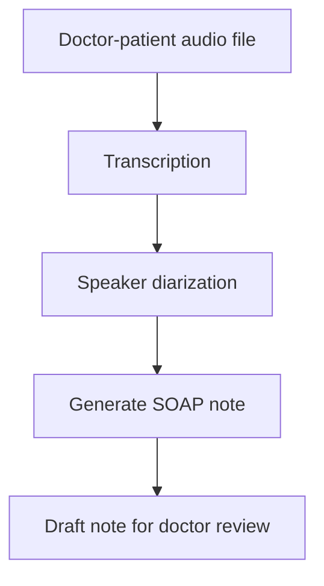

# ScribeX Workflow

Local, PHI-compliant pipeline that turns a doctor-patient audio recording
into a draft clinical SOAP note. Every processing step runs on-device —
no audio, transcript, or note ever leaves the machine.

## First Architecture for POC

## Try it — real input and output

| Stage | File | What it is |
|---|---|---|
| Input | [CAR0001.mp3](data/captured_audio/CAR0001.mp3) | Sample doctor-patient recording - click to open and play in GitHub |
| Transcript | [raw_transcript.json](myenv/output/CAR0001/raw_transcript.json) | Timestamped transcript from Whisper |
| Diarized transcript | [diarized_transcript.txt](myenv/output/CAR0001/diarized_transcript.txt) | Transcript with speaker labels |
| **Output** | **[soap_note.txt](myenv/output/CAR0001/soap_note.txt)** | **The generated draft SOAP note** |

Click the audio file above - GitHub opens it with a built-in play button,
no download needed. Click the SOAP note to read the actual generated
output from that recording.

## Measured performance (real run, not estimated)

| Stage | Hardware | Time |
|---|---|---|
| Transcription | GPU | 24.9s |
| Diarization | CPU | 366.4s |
| SOAP generation | GPU | 19.3s |

Overall: mostly faithful, one small hallucination, several real omissions — some clinically relevant.

Hallucination found (1):

Note says cannabis use is "5-10mg per week." Transcript says "about five milligrams... not that much." The "10mg" upper bound isn't in the transcript - the model invented a range where a single number was stated. Small, but it's a real fabricated detail, not just a paraphrase.
Borderline: note says pain "improves with sitting up." Transcript only confirms lying down makes it worse — sitting-up improvement is inferred, not stated. Reasonable clinical inference, but worth knowing it wasn't literally said.

Clinically relevant omissions (the more important finding):

Pain severity 7-8/10 — missing entirely. This is a core vital for a chest pain complaint and should be in Subjective.
No IV drug use, no other recreational drugs - missing. Relevant negative for endocarditis/infection differential in chest pain workup.
"Neck seems a little swollen" - missing. Potentially relevant (JVD) in a cardiac presentation, and it's a positive finding, not just a negative to skip.
No recent immobilization - missing. Relevant negative for PE risk stratification, which matters given the dyspnea.
Smoking duration (10-15 years) - missing, only "pack a day" captured. Pack-years matters for cardiac/pulmonary risk.
No loss of consciousness, pain worse with deep breath - both missing, both relevant.
