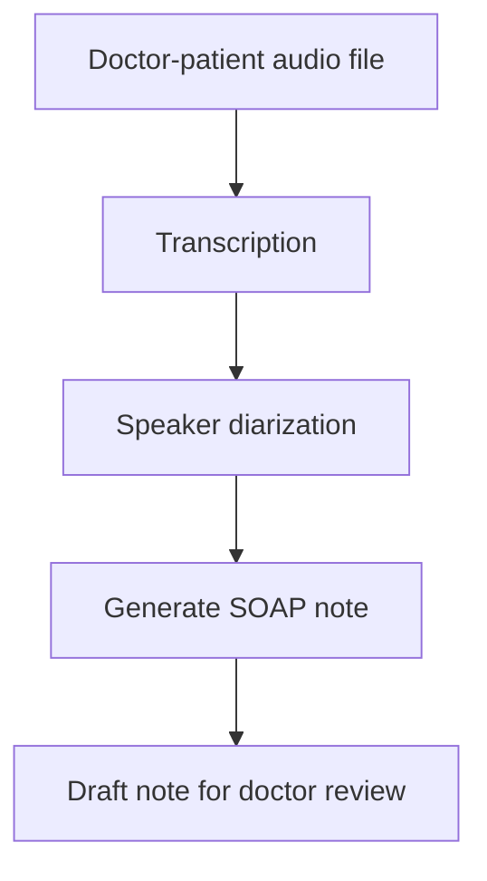

# ScribeX Workflow

Local, PHI-compliant pipeline that turns a doctor-patient audio recording
into a draft clinical SOAP note. Every processing step runs on-device —
no audio, transcript, or note ever leaves the machine.

## First Architecture for POC

## Try it — real input and output

| Stage | File | What it is |
|---|---|---|
| Input | [CAR0001.mp3](data/captured_audio/CAR0001.mp3) | Sample doctor-patient recording - click to open and play in GitHub |
| Transcript | [raw_transcript.json](myenv/output/CAR0001/raw_transcript.json) | Timestamped transcript from Whisper |
| Diarized transcript | [diarized_transcript.txt](myenv/output/CAR0001/diarized_transcript.txt) | Transcript with speaker labels |
| **Output** | **[soap_note.txt](myenv/output/CAR0001/soap_note.txt)** | **The generated draft SOAP note** |

Click the audio file above - GitHub opens it with a built-in play button,
no download needed. Click the SOAP note to read the actual generated
output from that recording.

## Measured performance (real run, not estimated)

| Stage | Hardware | Time |
|---|---|---|
| Transcription | GPU | 24.9s |
| Diarization | CPU | 366.4s |
| SOAP generation | GPU | 19.3s |

Overall: mostly faithful, one small hallucination, several real omissions — some clinically relevant.

Hallucination found (1):

Note says cannabis use is "5-10mg per week." Transcript says "about five milligrams... not that much." The "10mg" upper bound isn't in the transcript - the model invented a range where a single number was stated. Small, but it's a real fabricated detail, not just a paraphrase.
Borderline: note says pain "improves with sitting up." Transcript only confirms lying down makes it worse — sitting-up improvement is inferred, not stated. Reasonable clinical inference, but worth knowing it wasn't literally said.

Clinically relevant omissions (the more important finding):

Pain severity 7-8/10 — missing entirely. This is a core vital for a chest pain complaint and should be in Subjective.
No IV drug use, no other recreational drugs - missing. Relevant negative for endocarditis/infection differential in chest pain workup.

**the ideal output is supposedly like following:
_SOAP Note - DRAFT (corrected)

Subjective:

Chief Complaint: Chest pain

History of Present Illness:
39-year-old male presents with sharp chest pain, left-sided, that started last night (~8 hours duration) and has been constant. Pain is worse when lying down and with deep breathing. No radiation. Pain severity 7-8/10. Associated symptoms: lightheadedness, difficulty breathing (present since pain onset), mild heart palpitations, sweating (attributed by patient to difficulty breathing). No loss of consciousness. Denies recent immobilization. Onset occurred while moving furniture, though patient denies any injury at that time.

Review of Systems: Denies fever, chills, nausea, vomiting, abdominal pain, urinary symptoms, bowel symptoms, cough, hemoptysis, wheeze, night sweats, rash, or neck pain/trauma. Patient reports mild neck swelling on questioning.

Past Medical History: None. No prior hospitalizations or surgeries. No medications, no known drug allergies. Immunizations up to date.

Social History:

Lives alone in an apartment
Works as an accountant
Smokes ~1 pack/day, smoking history of 10-15 years
Cannabis use: ~5mg per week (occasional)
Denies other recreational or IV drug use
Alcohol: ~1-2 drinks/day (~10 drinks/week)
Exercises regularly (running ~30 min every other day); reports generally healthy diet with dinner, though lunches are often eaten out

Family History:

Father: myocardial infarction at age 45; possible hypercholesterolemia
No family history of stroke or cancer

Objective:
Vital signs: not recorded in transcript
Physical examination: not recorded in transcript

Assessment:
Acute chest pain, concerning for possible acute coronary syndrome (ACS) given sharp quality, associated dyspnea, palpitations, diaphoresis, and significant family history (paternal MI at 45). Differential includes musculoskeletal strain (recent furniture-moving, pain worse with deep inspiration) versus cardiac or pulmonary etiology. Reported neck swelling warrants further physical exam to rule out jugular venous distension. Modifiable cardiac risk factors present: smoking (10-15 pack-years), cannabis use.

Plan:

Admit for further evaluation
ECG, troponin, and cardiac enzyme panel
Chest X-ray
Physical examination including vital signs and assessment of reported neck swelling
Cardiology consult
Continue close monitoring for symptom change**
"Neck seems a little swollen" - missing. Poten_tially relevant (JVD) in a cardiac presentation, and it's a positive finding, not just a negative to skip.
No recent immobilization - missing. Relevant negative for PE risk stratification, which matters given the dyspnea.
Smoking duration (10-15 years) - missing, only "pack a day" captured. Pack-years matters for cardiac/pulmonary risk.
No loss of consciousness, pain worse with deep breath - both missing, both relevant.
