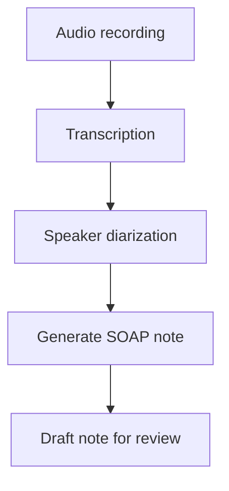
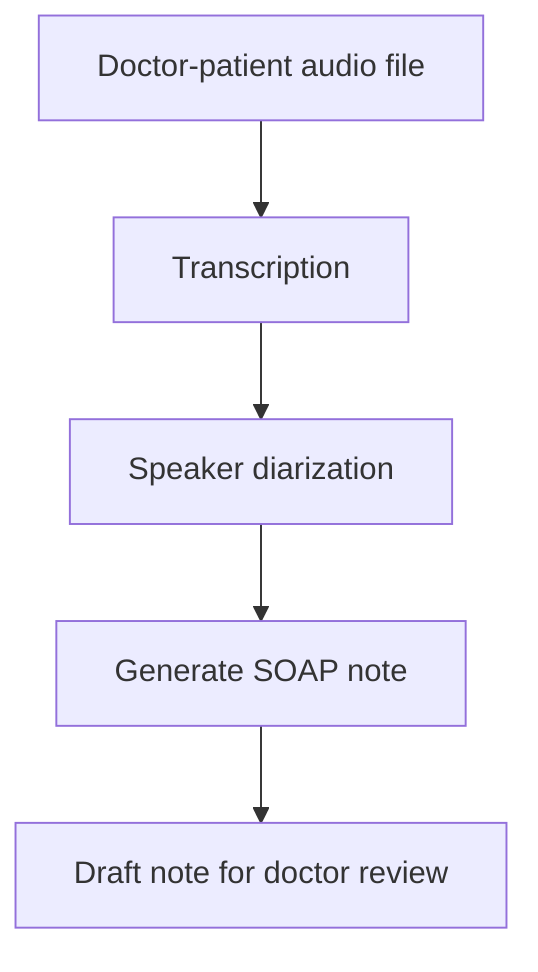

POC build

# ScribeXAgent

Local, PHI-compliant pipeline that turns a doctor-patient audio recording
into a draft clinical SOAP note. Every processing step runs on-device —
no audio, transcript, or note ever leaves the machine.

## Architecture

## Try it — real input and output

| Stage | File | What it is |
|---|---|---|
| Input | [CAR0001.mp3](data/captured_audio/CAR0001.mp3) | Sample doctor-patient recording — click to open and play in GitHub |
| Transcript | [raw_transcript.json](output/CAR0001/raw_transcript.json) | Timestamped transcript from Whisper |
| Diarized transcript | [diarized_transcript.txt](output/CAR0001/diarized_transcript.txt) | Transcript with speaker labels |
| **Output** | **[soap_note.txt](output/CAR0001/soap_note.txt)** | **The generated draft SOAP note** |

Click the audio file above — GitHub opens it with a built-in play button,
no download needed. Click the SOAP note to read the actual generated
output from that recording.

## Measured performance (real run, not estimated)

| Stage | Hardware | Time |
|---|---|---|
| Transcription | GPU | 24.9s |
| Diarization | CPU | 366.4s |
| SOAP generation | GPU | 19.3s |